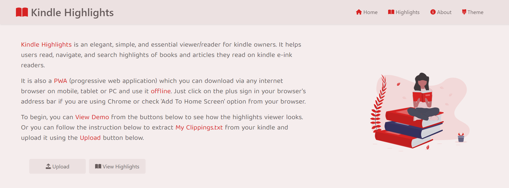
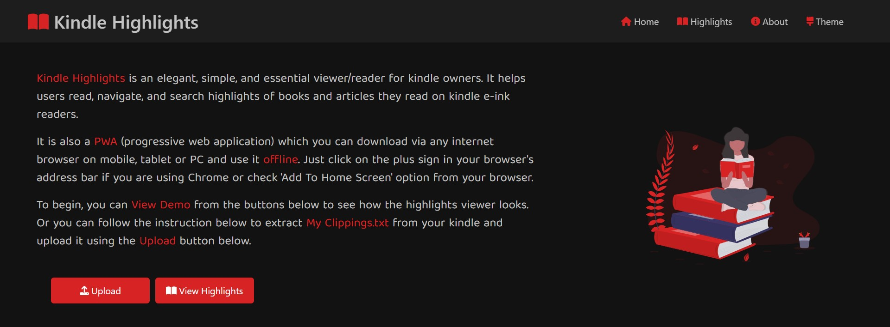
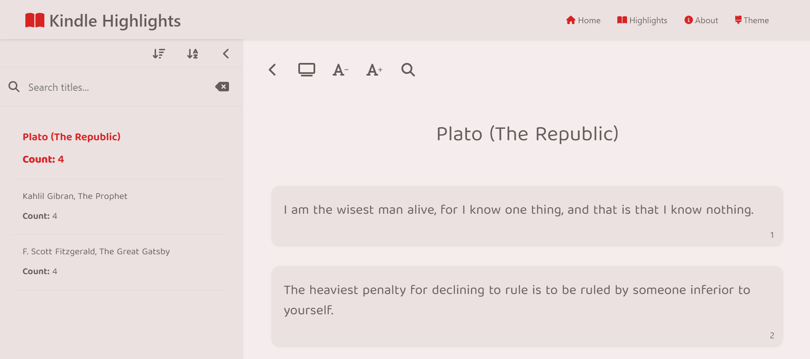
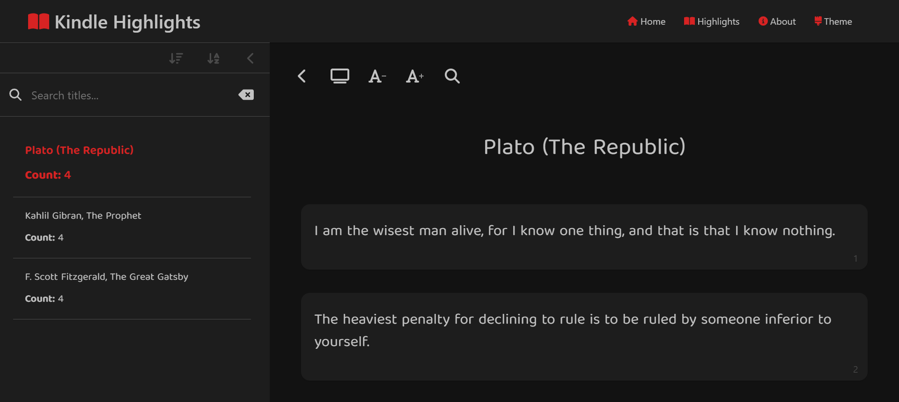
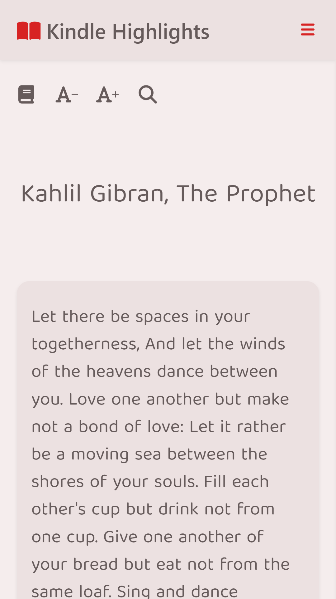
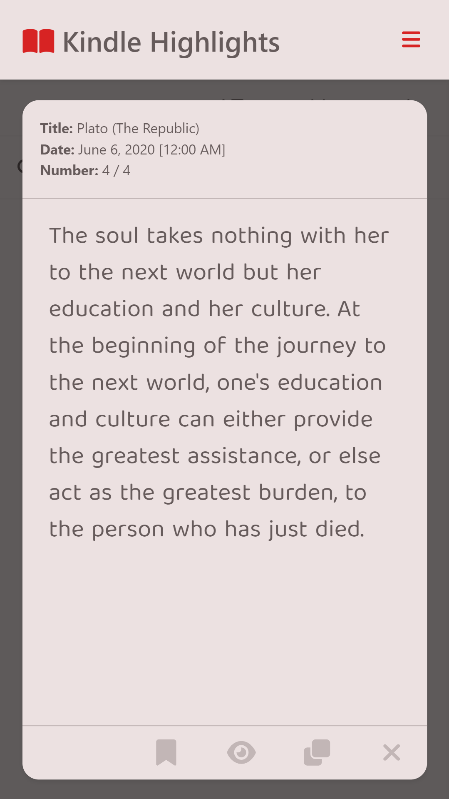
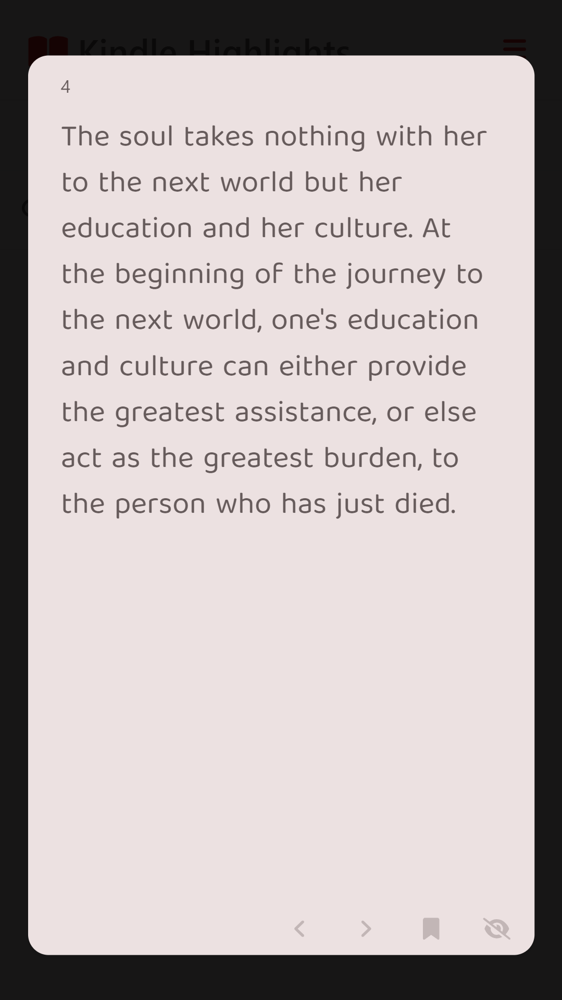

# 📐 Kindle Higlights Deployment Project

Kindle Highlights is a viewer for Kindle highlights and clippings. It supports mobile and desktop and can work fully offline once it is loaded or installed.

 

> 👉 To enjoy the app used by hundreds of users around the world, check the deplyed app here: **[Kindle Highlights](https://m-faried.github.io/Kindle-Highlights/)**

 

## 💻 Technologies & APIs
* Full application visual, layout, workflow design
* React
* React Router DOM
* Context API
* React Bootstrap
* NPM
* **Workbox** for Service Worker Creation and handling caching resources
* GitHub Pages for deployment

 

## About The Source Code:
The React source code is not avilable for public, only the compiled code is available.

 

## 📷 Preview:
 

    
    
     
     
    
    
     
     
    
     
     
    
     
     
        
     
     
        

 

## 💳 Contact Me:
You can send me an email on **m.a.faried@gmail.com** or chat with me on my **[LinkedIn](https://www.linkedin.com/in/mo-faried-0258a445/)** profile.