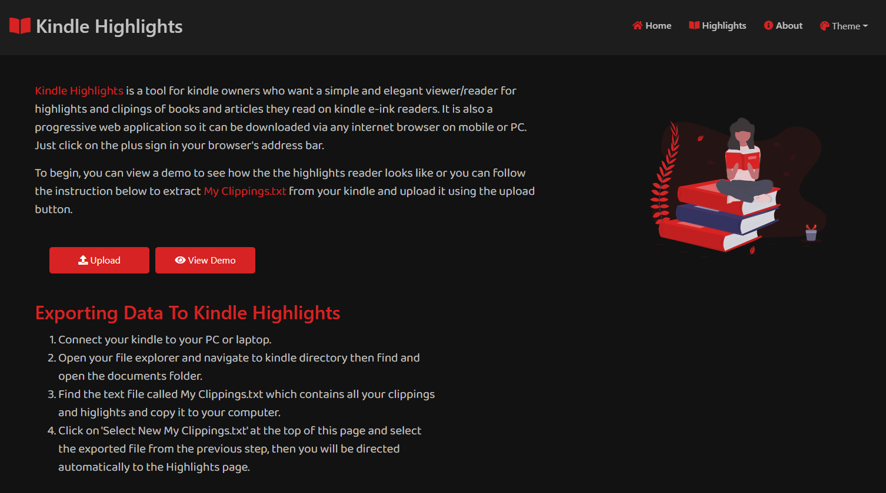
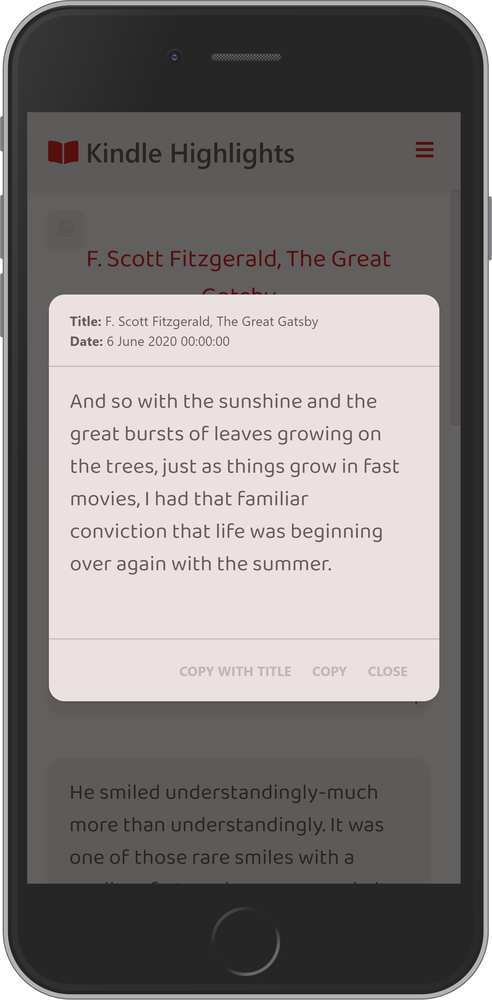

# Kindle Higlights Deployment Project

Kindle Highlights is a viewer for Kindle highlights and clippings.It supports mobile and desktop layouts and can be installed on both via browsers.

### Technologies & APIs
* Full application visual, layout, workflow design
* React
* React Router DOM
* Context API
* React Bootstrap
* NPM
* Workbox for Service Worker Creation and handling caching resources
* GitHub Pages for deployment

### Site Link [link](https://m-faried.github.io/Kindle-Highlights/)

### About The Source Code:
The React source code is not avilable for public, only the compiled code is available.

### Author
[Mo Faried](https://m-faried.github.io/m-faried-portfolio/)

# Preview

